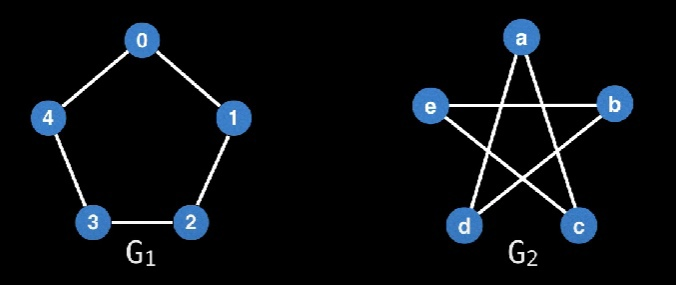
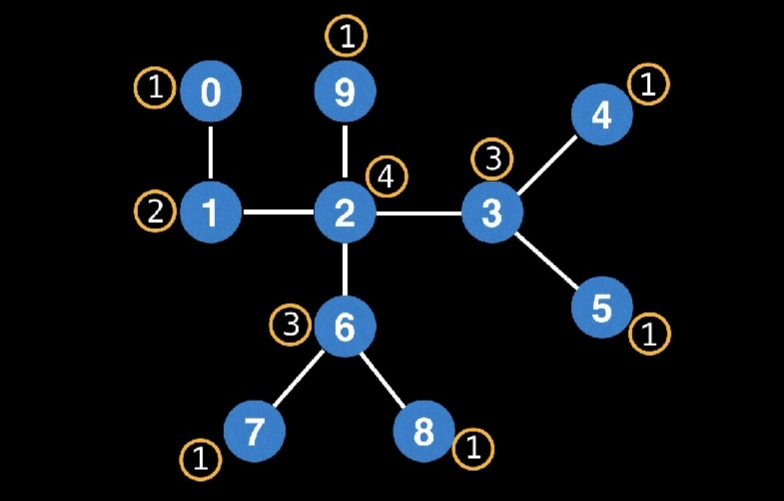
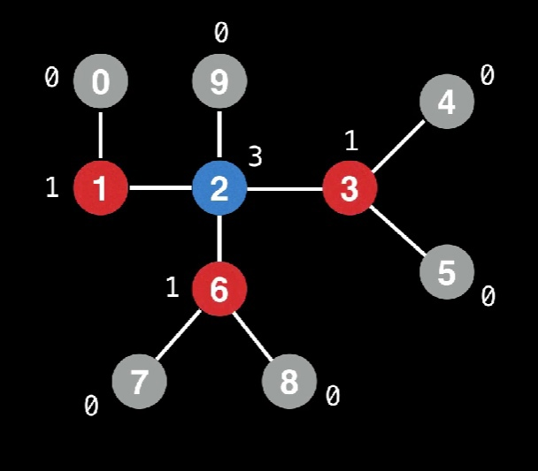
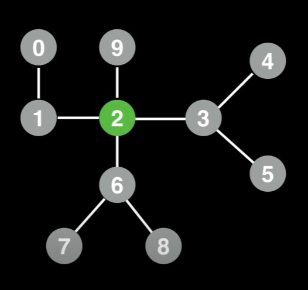
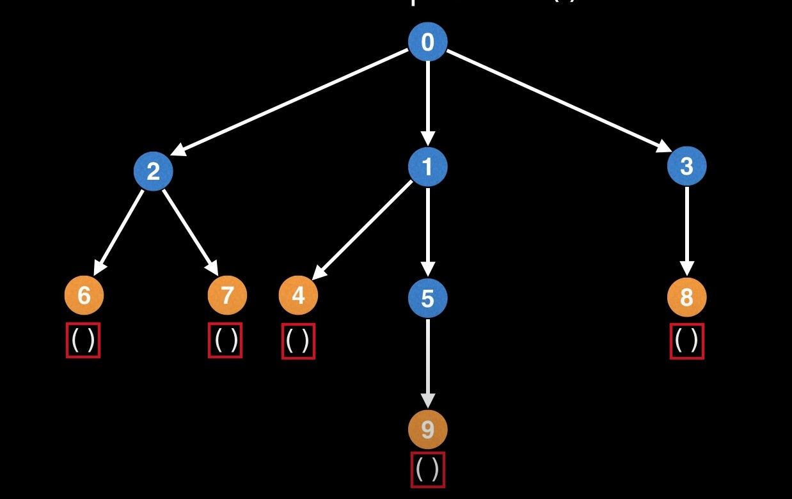
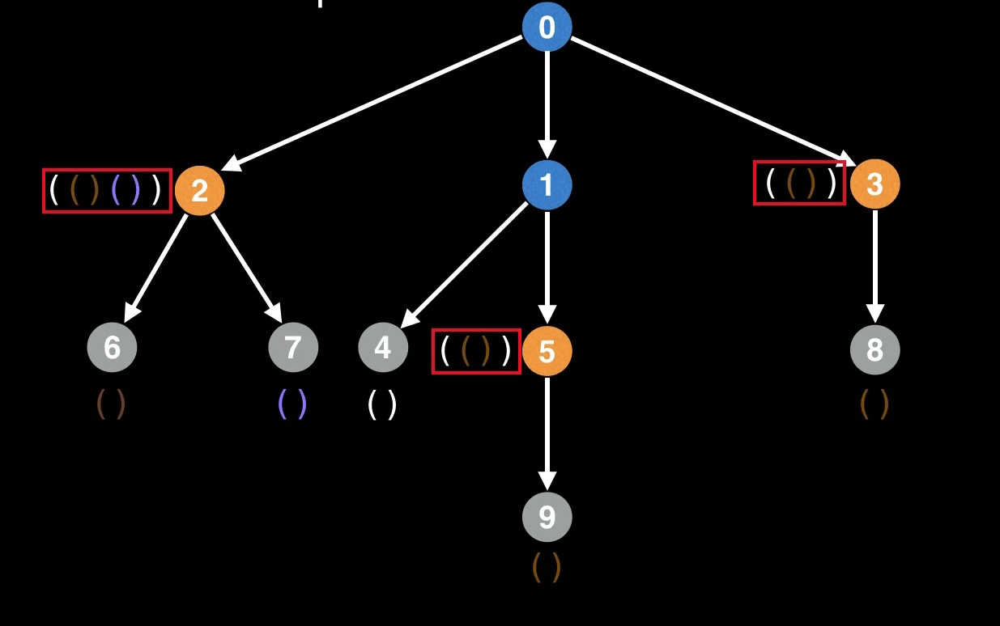
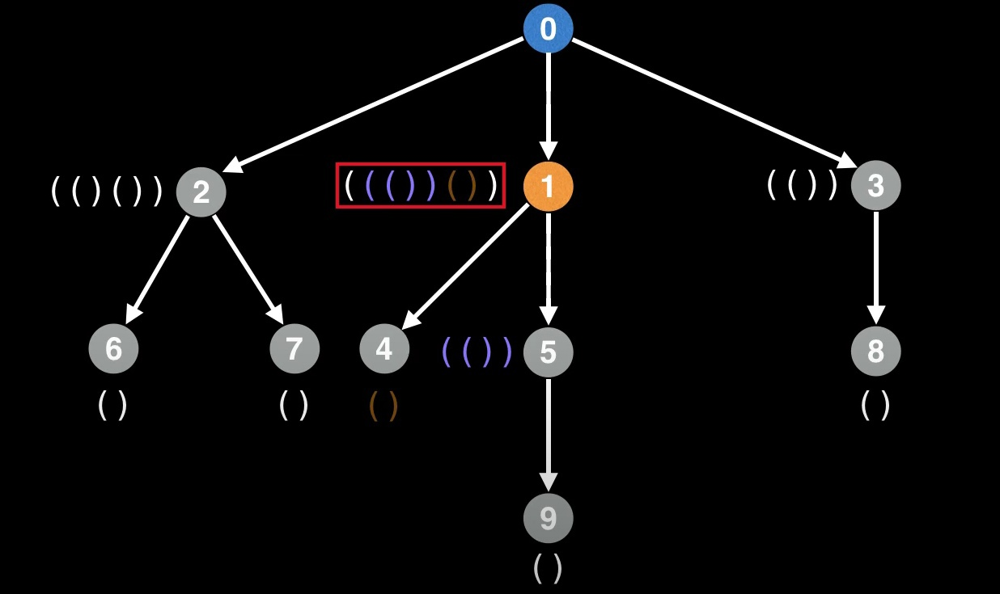
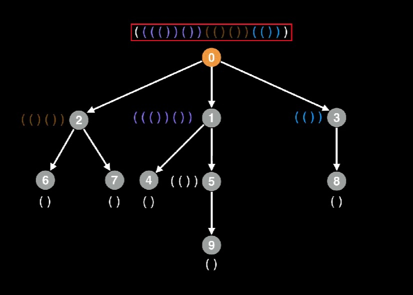
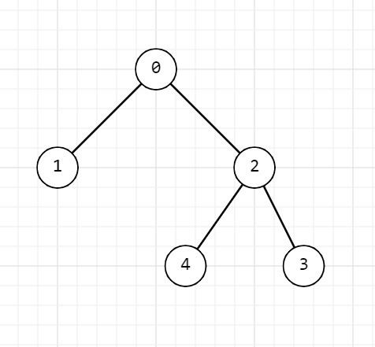

### МИНИСТЕРСТВО НАУКИ И ВЫСШЕГО ОБРАЗОВАНИЯ РОССИЙСКОЙ ФЕДЕРАЦИИ

### Федеральное государственное автономное образовательное учреждение высшего образования

## Дальневосточный федеральный университет
### ИНСТИТУТ МАТЕМАТИКИ И КОМПЬЮТЕРНЫХ ТЕХНОЛОГИЙ
### Департамент математического и компьютерного моделирования
### ДОКЛАД о практическом задании по дисциплине АИСД
---
# __Изоморфизм деревьев__
<!-- дать понятия: биекция  -->
#### *Попова Светлана Олеговна*
#### *студент гр. Б9121-09.03.03 пикд*
#### *г. Владивосток, 2022*
---
## __Введение__
---

>Изоморфизм -это очень общее понятие, которое встречается в нескольких областях математики. Слово происходит от греческого iso, что означает “равный”, и morphosis, что означает “формировать”. Он представляет взаимную связь между двумя похожими системами. 

Когда мы спрашиваем: "Изоморфны ли два графа?" - то по сути спрашиваем: "Одинаковы ли они структурно?" Рассмотрим картинку ниже:



Графы G1 и G2 помимо того, что выглядят по разному, так еще и помечены по другому. Но структурно это один и тот же граф, нужно лишь посмотреть под другим углом, а значит они изоморфны. 

---
### __Проблема__
Как выяснилось определение изоморфизма графов не очевидно для человеческого глаза, что уж говорить об анализе больших данных, таких как - сплайсинг генов, анализ белков или молекулярная биология, где химические структуры и вовсе представляют собой деревья с миллионами вершин. 

На ум приходит помощь компьютеров, однако для них это всё так же является сложной проблемой.

---

В данной работе мы построим алгоритм для определения изоморфизма деревьев. До сих пор не ясно, существует ли полиномиальный алгоритм его решения в классе всех графов. Однако для частного случая графов, таких как деревья, существуют алгоритмы полиномиального времени, самые ранние из которых принадлежат Ахо А. Хопкрофту Дж., Ульман Дж. Здесь мы имеем дело с изоморфизмом корневых деревьев, $(T, r)$ где $T$ - дерево, а $r$ - специальная вершина, называемая корнем дерева. 

Несколько слов о структуре работы:

* 1 раздел: выявление проблем и постановка задачи
* 2 раздел: дадим определения терминам
* 3 раздел: описание идеи алгоритма
* 4 раздел: описание реализации
* 5 раздел: ...

---
## __Терминология__
<!-- изоморфизм графа, изоморфизм дерева, дерево, граф -->
---
### __Граф__

Графом $G(V,E)$ называется пара двух конечных множеств; множество точек и множество линий, соединяющих некоторые пары точек.
$$G(V,E) = \langle V,E\rangle, V \neq \varnothing, E	\subseteq V \times V, \{ v,v \} \notin E, v \in V$$
то есть множество $E$ состоит из 2-элементных подмножеств множества $V$.

Точки называются ***вершинами***, или ***узлами***, графа, линии - ***рёбрами*** графа.

### __Изоморфизм графов__

Графы $G_1(V_1, E_1)$ и $G_2(V_2, E_2)$ изоморфны, если существует биекция между множествами вершин $V_1 \rightarrow V_2$ так что:
$$\forall u,v \in V_1, (u,v) \in E_1 \Leftrightarrow (\varphi(u),\varphi(v)) \in E_2$$

С точки зрения непрофессионала должна существовать функция, которая может сопоставить все узлы и ребра из $G1$ в $G2$ и наоборот.

### __Корневые деревья__

Деревом называется произвольный связный граф без циклов.

Корневое дерево - ориентированное дерево, которое удовлетворяет условиям:
1. Имеется ровно один узел в который не входит не одно ребро, этот узел - ***корень***.
2. В каждый узел кроме корня входит ровно одно ребро.
3. Из корня имеется путь к любому ребру.

***Лист дерева*** - это узел, из которого не выходит ни одной дуги.

***Предок*** - узел, имеющий родительский узел.

***Родитель*** - узел, имеющий ребро, соединяющее его с узлом-потомком.

---
## __Описание алгоритма__
---

Существует несколько очень быстрых (обычно основанных на хешировании или эвристике) алгоритмов для идентификации изоморфных деревьев. Они, как правило, быстры, но также подвержены ошибкам из-за коллизий хэшей в ограниченном целочисленном пространстве (это ситуация, когда несколько записей попадают в одну и ту же ячейку). 

У этих алгоритмов есть и плюсы, когда дело доходит до конкурентного программирования и проверки равенства огромных деревьев.

Однако мы рассмотрим алгоритм **AHU**, который сериализует дерево в уникальную кодировку. Мы кодируем наше дерево в простую строку и если другое дерево имеет такую же кодировку, то эти деревья принято считать изоморфными.

Мы можем напрямую сериализовать некорневое дерево, но на практике сериализация корневого дерева обычно проще с точки зрения кода. Так как изоморфизм сохраняет совпадения ребер, поэтому, если мы начнем с корня, то ожидаем увидеть одинаковое количество уровней и равное количество вершин на каждом уровне. 

Перейдем к рассмотрению процесса кодирования дерева.

### __Поиск центра дерева__


Следует обратить внимание на одно предостережение. Перед сериализацией необходимо убедиться, что у наших деревьях выбран один и тот же корневой узел. Иначе мы получим две разные кодировки. Это легко избежать путем поиска центра дерева.

Единственное, о чем стоит помнить при нахождении центра дерева - это то, что центров может быть несколько, как правило 1 или 2.

Наш способ нахождения центра будет заключаться в многократном удалении внешнего слоя листовых узлов. Этот процесс напоминает очистку слоев лука (начинаешь с наружи, пока не дойдешь до сердцевины).

1. Вычисляем степень каждого узла. Это количество узлов, с которыми он связан. Из рисунка мы наблюдаем, что конечные узлы соеденены лишь с одним другим узлом.

2. Как только мы узнаем, какие узлы листовые, мы можем обрезать их и обновить степень узлов.

3. Находим новые узлы со степенью один и снова их обрезаем.
4. Делаем это до тех пор пока не останется 1 или 2 узла, они и будут нашими центрами.
 
### __Кодирование дерева__
Теперь нам нужно сгенерировать кодировку для каждого дерева и сравнить сериализованные деревья на равенство.

1. Мы должны начать с присвоения пустой пары скобки, состоящей из левой и правой скобок "()", каждому листовому узлу нашего дерева, как показано ниже.

2. Теперь нам нужно двигаться вверх (к родительским узлам листьев) и объединить круглые скобки листьев вместе и назначить их родительскому. Поскольку мы объединяем круглые скобки листьев, мы также должны заключить результат в другую пару круглых скобок.

3. Важно, что на этапе объединения дочерние ярлыки должны быть отсортированы

4. Этот процесс продолжается до тех пор, пока мы не достигнем корневого узла. Здесь объединяется и сортируется уникальная кодировка, что будет хранится в корневом узле.


>Не забываем отсортировать скобки перед их объединением. 
Сортировка выполняется лексикографически.
---
### __Краткое описание кодирования дерева__
---
Вкратце о том, что мы сделали для AHU:

1. Конечные узлы обозначаются левой и правой круглой скобкой "()"
2. Каждый раз, когда мы движемся вверх, объединяем, сортируем и заключаем в скобки.
3. Мы не можем обработать узел, пока не обработаем все его дочерние элементы.

---
## __Реализация на С++__
---

Исходный код можно найти [здесь](https://github.com/PufMe/isomorphic/blob/main/algorithm/IsomorphismTree.cpp)

Основные этапы реализации:
* Поиск центра;
* Кодирование деревьев относительно найденых центров;
* Сравнение деревьев на изоморфизм.
* 
### Поиск центра дерева

Псевдокод:
```c++
function FindTreeCenter(tree) {
    vertex_count = tree.size();

    degree[0, 0, 0, ..., 0];
    leaves[];

    for (int i = 0; i < vertex_count; i++) {
        degree[i] = tree[i].size();
        if (degree[i] == 0 || degree[i] == 1) {
            leaves.push(i);
            degree[i] = 0;
        }
    }

    leaves_count = leaves.size();

    while (leaves_count < vertex_count) {

        new_leaves[];

        for (int node : leaves) {
            for (int neighbour : tree[node]) {
                degree[neighbour] = degree[neighbour] - 1;
                if (degree[neighbour] == 1)
                    new_leaves.push(neighbour);
            }
            degree[node] = 0;
        }
        leaves_count += new_leaves;

    }
    return leaves;
}
```
Функция ___findTreeCenter___ принимает в качестве входных данных дерево, хранящееся в переменной ___tree___

* переменная ___vertex_count___ - хранит количество вершин в дереве
* массив ___degreee___ - это массив степеней каждой вершины (степень считается количеством связей одной вершины с другими)
* массив ___leaves___ - в нем будем сохранять листья

Первым циклом мы просматриваем список смежности и подсчитываем количество ребер выходящие из каждого узла.
```c++
for (int i = 0; i < vertex_count; i++) {
        degree[i] = graph[i].size();
```
Следующим условием мы проверяем является ли наше дерево с одним узлом или является ли узел листом(имеет одно ребро). После мы добавляем вершину в массив листьев. А степень приравниваем к нулю, чтобы не обрабатывать этот лист повторно.
```c++
if (degree[i] == 0 || degree[i] == 1) {
            leaves.push(i);
            degree[i] = 0;
        }
```
Переменная ___leaves_count___ - счетчик, который будет отслеживать количество обработанных вершин.

Мы узнаем какие вершины являются центрами только тогда, когда обработаем все узлы в дереве.
```c++
while (leaves.size() < vertex_count) {
```
При входе в цикл создается массив ___new_leaves___ который будет хранить в себе новые листья. Это нужно, чтобы избежать помех со старыми листьями на текущем слое.

Обрабатываем всех соседей этих узлов, уменьшая степень у соседних вершин. Если после соседний узел после уменьшения имеет степень 1, значит он является листом для нового слоя. Добавляем его в массив листьев. 
```c++
for (int node : leaves) {
            for (int neighbour : tree[node]) {
                degree[neighbour] = degree[neighbour] - 1;
                if (degree[neighbour] == 1)
                    new_leaves.push(neighbour);
```
После обработки узла присваиваем ему нулевую степень.

---

### Кодирование дерева

```c++
string encode(vector<vector<int>>& tree, int& vertex, vector<bool>& visit){

    if(visit[vertex]){
        return "";
    }
    visit[vertex] = true;
    if(tree[vertex].size() == 1){
        return "()";
    }
    vector<string> label;
    for(int i : tree[vertex]){
        label.push_back(encode(tree, i, visit));
    }
    sort(label.begin(),label.end());

    string result = "";
    for(string l: label){
        result += l;
    }
    return "(" + result + ")";
}
```
Функция ```encode``` необходима для кодирования дерева в уникальную строку. На вход функция принимает список смежности ```tree```, id центра дерева и булевый массив ```visit```, который будет отслеживать посещение вершины.


Сначала мы проверяем, бывали ли мы уже в данной вершине. Если да, то мы ничего с ней не делаем и возвращаем пустую строку.
```c++
if(visit[vertex]){
        return "";
    }
```
Иначе, помечаем наше пребывание в данной вершине и переходим к следующему условию.
Тут мы проверяем, находимся ли мы в листе. Это означает, что дальше спускаться некуда. Это и будет опорной точной для рекурсии.
```c++
if(tree[vertex].size() == 1){
        return "()";
    }
```
Для каждого узла мы ведем список меток для всех поддеревьев. Чтобы сгенерировать метки, проходимся по всем дочерним элементам этого узла и рекурсивно вызываем функцию ```encode```, сохраняя результат в списке меток ```label```. 
```c++
vector<string> label;
for(int i : tree[vertex]){
    label.push_back(encode(tree, i, visit));
}
```
После цикла ```for``` рекурсивные вызовы вернулись. Начинаем этап сортировки.
```c++
sort(label.begin(),label.end());
```
Последним шагом объединим метки в строку ```result``` и заключим итоговый результат в круглые скобки.
```c++
string result = "";
for(string l: label){
    result += l;
}
return "(" + result + ")";
```

#### __Случай с одним центром__

```c++
bool treesAreIsomorphic(vector<int>& tree1, vector<int>& tree2){
    
    vector<vector<int>> t1 = arrConvert(tree1);
    vector<vector<int>> t2 = arrConvert(tree2);

    vector<int> centerT1 = findTreeCenter(t1);
    vector<int> centerT2 = findTreeCenter(t2);
    
    vector<bool> visitT1 (tree1.size(),0);
    vector<bool> visitT2 (tree2.size(),0);
    
    string encodeT1 = encode(t1, centerT1[0], visitT1);
    string encodeT2 = encode(t2, centerT2[0], visitT2);

    if( encodeT1 == encodeT2){
        return true;
    }
}
```
Функция ```treesAreIsomorphic``` завершающая в нашем коде. Здесь применяются все функции и методы описанные ранее. На вход она принимает два вектора ```tree1``` и ```tree2```,в которых хранятся связи вершин деревьев

Рассмотрим ситуацию, когда у деревьев по одному центру.

Конвертируем массивы ```tree1``` и ```tree2``` в списки смежности
```c++
vector<vector<int>> t1 = arrConvert(tree1);
vector<vector<int>> t2 = arrConvert(tree2);
```
Далее ищем центры деревьев.

```c++
vector<int> centerT1 = findTreeCenter(t1);
vector<int> centerT2 = findTreeCenter(t2);
```
Создаем массивы ```visit```, что будут отслеживать посещение вершин.
```c++
vector<bool> visitT1 (tree1.size(),0);
vector<bool> visitT2 (tree2.size(),0);
```
Кодируем деревья в уникальные строки.
```c++
string encodeT1 = encode(t1, centerT1[0], visitT1);
string encodeT2 = encode(t2, centerT2[0], visitT2);
```
Если строки идентичны, значит деревья изоморфны.
#### __Случай с 2-мя центрами__
Теперь рассмотрим ситуацию с двумя центрами. Для более удачной кодировки, дерево разбивается на два поддерева, корнями которого являются найденные центры.
```c++
vector<bool> visitT1 (tree1.size(),0);
vector<bool> visitT12 (tree1.size(),0);

vector<bool> visitT2 (tree2.size(),0);
vector<bool> visitT22 (tree2.size(),0);

visitT1[centerT1[1]] = 1;
visitT12[centerT1[0]] = 1;

visitT2[centerT2[1]] = 1;
visitT22[centerT2[0]] = 1;

string encodeT1 = encode(t1, centerT1[0], visitT1);
string encodeT12 = encode(t1, centerT1[1], visitT12);

string encodeT2 = encode(t2, centerT2[0], visitT2);
string encodeT22 = encode(t2, centerT2[1], visitT22);

if(encodeT1 == encodeT2 && encodeT12 == encodeT22){
    return true;
}else if(encodeT1 == encodeT22 && encodeT2 == encodeT12){
    return true;
}
```
Для того, чтобы кодирование не затронуло всё дерево, а лишь свое поддерево, мы помечаем оставшийся центр в массиве посещений ```visit```, так мы заблокируем путь к другому поддереву.
```c++
visitT1[centerT1[1]] = 1;
visitT12[centerT1[0]] = 1;

visitT2[centerT2[1]] = 1;
visitT22[centerT2[0]] = 1;
```
Сравниваем поддеревья друг с другом. Возможны две ситуации, когда возможен изоморфизм. Если одно из условий выполнимо, то деревья изоморфны.
```c++
if(encodeT1 == encodeT2 && encodeT12 == encodeT22){
    return true;
}else if(encodeT1 == encodeT22 && encodeT2 == encodeT12){
    return true;
}
```

## Тестирование и анализ производительности
### Ручное тестирование
Для проверки работоспособности кода, были придуманы тесты, затрагивающие различные ситуации:
1) Деревья с одним центром;
2) Деревья с двумя центрами;
3) Деревья с двумя центрами, но изоморфно лишь одно поддерево.
4) Деревья с различным количеством центров;
5) Деревья с различным количеством вершин;
6) Пустые деревья;
7) Деревья с одной вершиной;
8) Деревья с множеством детей, идущих от корня;
9) Бинарные деревья;
10) Деревья тростники;
11) Деревья с большим количеством вершин.

Визуализации тестов можно посмотреть [здесь](https://github.com/PufMe/isomorphic/blob/main/docs/tree.md)
 
#### __Реализация тестов__

Формат входных данных:
Для входных данных я решила использовать массив из целых чисел, в котором будут отображаться связанные вершины.

Пример:

Пусть дан массив ```tree``` с некоторыми данными:
```c++
vector<int> tree = {-1, 0, 0, 2, 2};
```
Логика для заполнения массива такова:
1) Присваиваем id == 0 значение -1. Это означает, что данная вершина, теперь считается корнем дерева и от нее будут зависеть остальные связи.
2) Теперь каждому id необходимо в значениях присвоить id его родителя.


| id        | 0   | 1   | 2   | 3   | 4   |
|-----------|-----|-----|-----|-----|-----|
| __value__ | -1  | 0   | 0   | 2   | 2   |

Пример получившегося дерева:


Пример теста:
```c++
void Test1(){
    std::vector<int> tree1 = {-1, 0, 1, 2, 3, 3};
    std::vector<int> tree2 = {-1, 0, 0, 0, 1, 4};

    if(treesAreIsomorphic(tree1,tree2)){
        cout << "Test1: isomorphic" << endl;
    }else{
        cout << "Test1: not isomorphic" << endl;
    }
}
```
Файл с тестами находится [здесь](https://github.com/PufMe/isomorphic/blob/main/test/test.cpp)

### Анализ производительности
#### Принцип анализа
#### Итоговые результаты 


---
## Список литературы
---
1. Alexander Smal "Explanation for ‘Tree isomorphism’ talk" Saint-Petersburg, Russia 2008
2. [Identifying Isomorphic Trees](https://youtu.be/OCKvEMF0Xac)
3. [Статья Kelvin Jose "Graph Theory | Isomorphic Trees"](https://towardsdatascience.com/graph-theory-isomorphic-trees-7d48aa577e46)
4. [Isomorphism - Wikipedia](https://en.wikipedia.org/wiki/Isomorphism)
5. [Tree](https://docs.yandex.ru/docs/view?tm=1668726048&tld=ru&lang=en&name=tree.pdf&text=isomorphism%20tree&url=https%3A%2F%2Fwww.imsc.res.in%2F~vikram%2FDiscreteMaths%2F2011%2Ftree.pdf&lr=120836&mime=pdf&l10n=ru&sign=1672761d0021e3a403e8a941f236de9b&keyno=0&nosw=1&serpParams=tm%3D1668726048%26tld%3Dru%26lang%3Den%26name%3Dtree.pdf%26text%3Disomorphism%2Btree%26url%3Dhttps%253A%2F%2Fwww.imsc.res.in%2F~vikram%2FDiscreteMaths%2F2011%2Ftree.pdf%26lr%3D120836%26mime%3Dpdf%26l10n%3Dru%26sign%3D1672761d0021e3a403e8a941f236de9b%26keyno%3D0%26nosw%3D1)
6. Изоморфизм — статья из Математической энциклопедии. О. А. Иванова., Д. М. Смирнов
7. [Identifying Isomorphic Trees](https://youtu.be/OCKvEMF0Xac)
8. Алгоритм проверки изоморфизма деревьев О. В. Разин
9. [Изоморфизм графов - Wikipedia](https://ru.wikipedia.org/wiki/Изоморфизм_графов#:~:text=В%20теории%20графов%20изоморфизмом%20графов.,ориентации%20дуг%20и%20значений%20весов)
10. Гудман С., Хидетниеми С. Введение в разработку и анализ алгоритмов. - М.: Мир, 1981. - 368 с.
11. Рейнгольд Э., Hивергельт Ю., Део H. Комбинаторные алгоритмы. Теория и практика. - М.: Мир, 1980. - 476 с.
12. Зыков А.А. Основы теории графов. М.: Наука, 1987. - 384 с.
13. Татт У. Теория графов. - М.: Мир, 1988. - 424 с.
14. Земляченко В.Н., Корнеенко Н.М., Тышкевич Р.И. Проблема изоморфизма графов // Теория сложности вычислений, I. Записки научных семинаров ЛОМИ. - 1982. - Т.118. - С.83-158.
15. [Tree Isomorphism Problem - GeekforGeeks](https://www.geeksforgeeks.org/tree-isomorphism-problem/)
16. [Алгоритм проверки двух графов на изоморфизм - Колесникова А. Н.](https://otherreferats.allbest.ru/mathematics/00532854_0.html)
17. [Методическая разработка "Деревья"](https://infourok.ru/metodicheskaya-razrabotka-izomorfizmi-grafov-derevya-2558525.html)
18. [Программный метод проверки изоморфизма деревьев](https://pandia.ru/text/77/473/006489.php)
19. [Изоморфизм — Теория графов](https://ru.hexlet.io/courses/graphs/lessons/isomorphism/theory_unit)
20. [Алгоритмы, весна 2021, 1 курс, идеальное хеширование, изоморфизм деревьев](https://youtu.be/BrJEklQOiVU)
21. [НОУ ИНТУИТ - Лекция - Каркасы и изоморфизм деревьев](https://intuit.ru/studies/courses/58/58/lecture/1730?page=2)
22. https://logic.pdmi.ras.ru/~hirsch/students/cs-math/lecture6.tex
23.  [Дискретная математика - Алексеев Валерий Борисович ВМК МГУ](https://docs.yandex.ru/docs/view?tm=1675428118&tld=ru&lang=ru&name=discrete-math-alekseev-M.pdf&text=изоморфизм%20деревьев&url=https%3A%2F%2Fteach-in.ru%2Ffile%2Fsynopsis%2Fpdf%2Fdiscrete-math-alekseev-M.pdf&lr=120836&mime=pdf&l10n=ru&sign=cff60efb3d408feea3c41777f45dc11b&keyno=0&nosw=1&serpParams=tm%3D1675428118%26tld%3Dru%26lang%3Dru%26name%3Ddiscrete-math-alekseev-M.pdf%26text%3D%25D0%25B8%25D0%25B7%25D0%25BE%25D0%25BC%25D0%25BE%25D1%2580%25D1%2584%25D0%25B8%25D0%25B7%25D0%25BC%2B%25D0%25B4%25D0%25B5%25D1%2580%25D0%25B5%25D0%25B2%25D1%258C%25D0%25B5%25D0%25B2%26url%3Dhttps%253A%2F%2Fteach-in.ru%2Ffile%2Fsynopsis%2Fpdf%2Fdiscrete-math-alekseev-M.pdf%26lr%3D120836%26mime%3Dpdf%26l10n%3Dru%26sign%3Dcff60efb3d408feea3c41777f45dc11b%26keyno%3D0%26nosw%3D1)
24. [Изоморфизм графов некоторых классов - Яруниной Анастасии Александровны - Саратов 2017](http://elibrary.sgu.ru/VKR/2017/10-05-01_002.pdf)
25. Wilson R.A. Graphs, colourings and the four-colour theorem / R.A. Wilson London : Oxford University Press, 2002
26. [Центры дерева](https://studfile.net/preview/2015721/page:30/)
27. [Алгоритмы на деревьях - Викиконспекты](https://neerc.ifmo.ru/wiki/index.php?title=Алгоритмы_на_деревьях)
